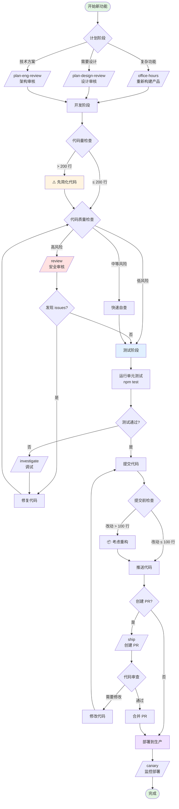
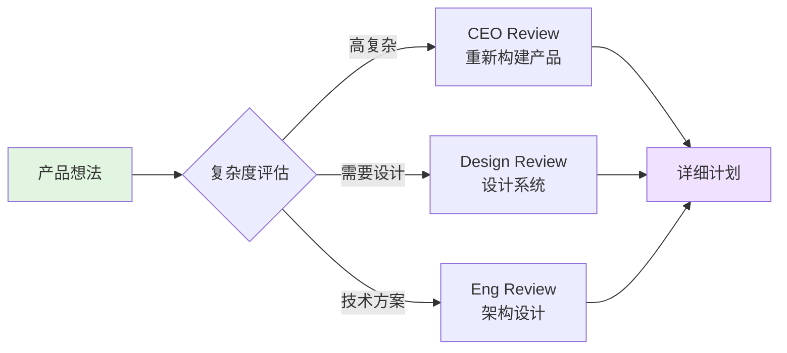
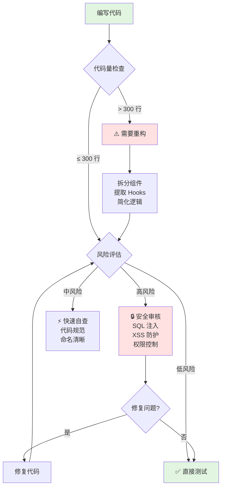
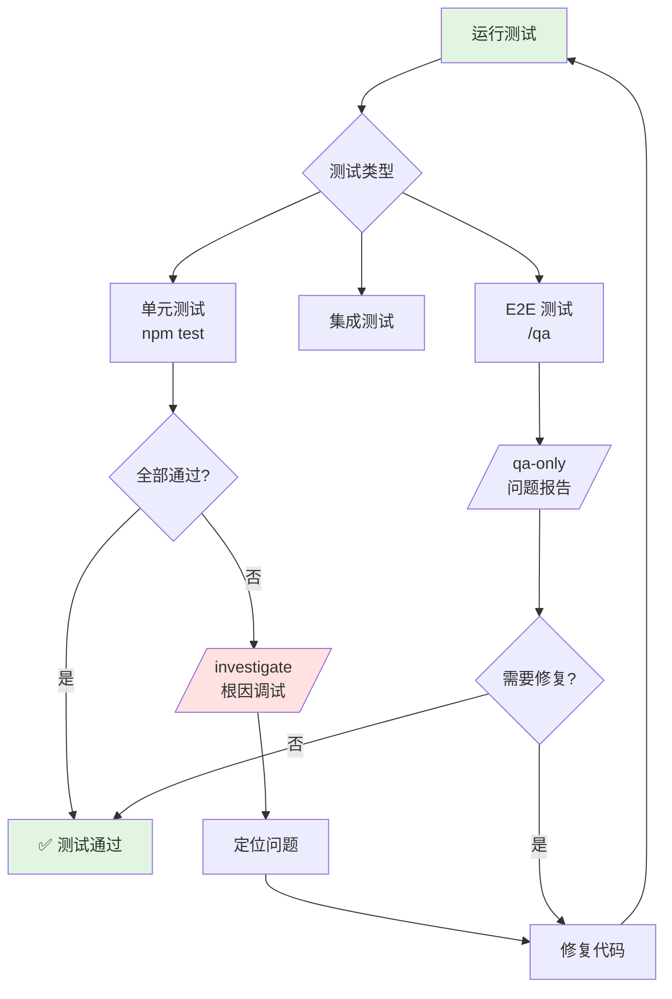
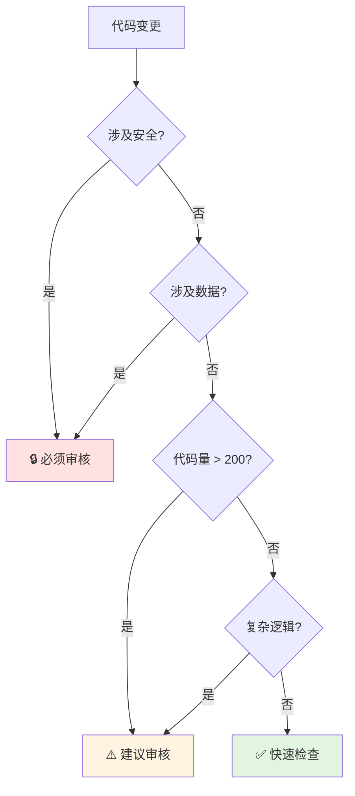
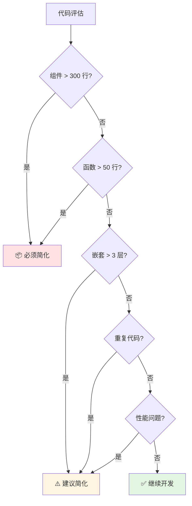
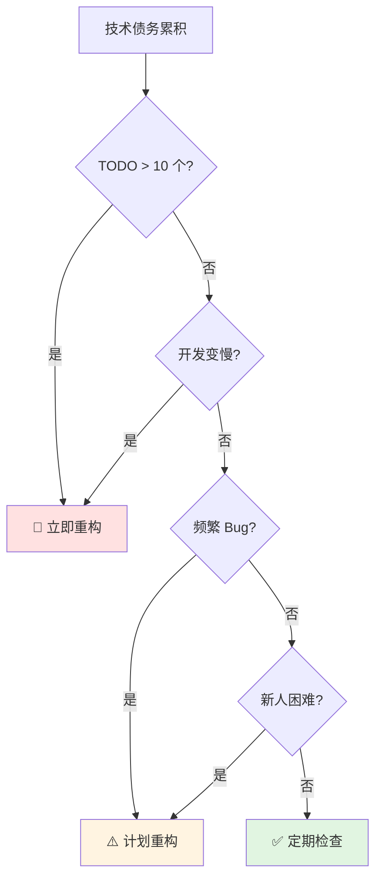
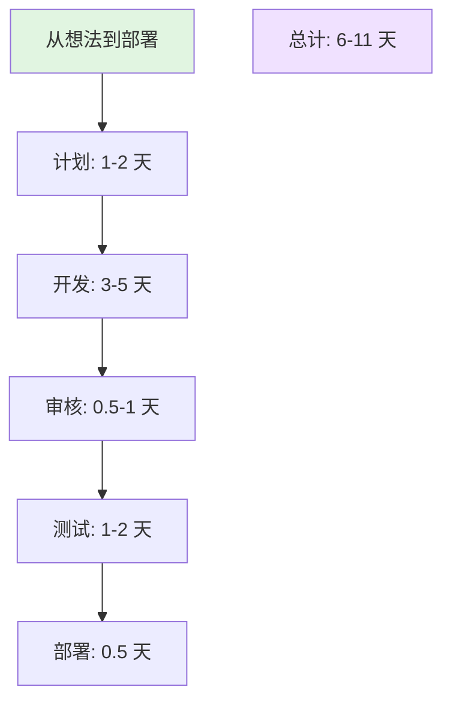

# PromptBox 开发工作流可视化

> **版本**: v1.0
> **更新时间**: 2026-03-22
> **适用范围**: 全栈开发、代码质量保证

---

## 🎯 完整工作流程图



---

## 🔍 详细阶段说明

### **阶段 1: 计划与设计** 📋



**工具**: `/office-hours`, `/plan-ceo-review`, `/plan-eng-review`, `/plan-design-review`

---

### **阶段 2: 开发与代码质量** 💻



**代码质量检查清单:**

```yaml
高风险（必须审核）:
  - ✅ 数据库操作
  - ✅ 用户输入处理
  - ✅ 权限控制
  - ✅ 支付认证
  - ✅ 外部 API 调用

中风险（建议审核）:
  - ✅ 状态管理
  - ✅ 并发操作
  - ✅ 复杂算法
  - ✅ 性能敏感

低风险（快速检查）:
  - ✅ UI 样式调整
  - ✅ 文本修改
  - ✅ 简单重构
```

**工具**: `/review`, `/simplify`, ESLint, Prettier

---

### **阶段 3: 测试与调试** 🧪



**测试覆盖目标:**

```javascript
// 关键路径: 100% 覆盖
- 用户认证
- 支付流程
- 权限控制
- 数据操作

// 重要功能: >80% 覆盖
- 核心业务逻辑
- API 调用
- 状态管理

// UI 组件: >70% 覆盖
- 交互逻辑
- 表单验证
- 边界情况
```

**工具**: Vitest, `/qa`, `/qa-only`, `/investigate`

---

### **阶段 4: 提交与代码审查** 📝

```mermaid
graph TB
    A[提交代码] --> B{提交前检查}
    B --> C[git diff --stat<br/>查看改动量]

    C --> D{改动评估}
    D -->|> 200 行| E[⚠️ 考虑拆分]
    D -->|≤ 200 行| F[编写提交信息]

    E --> F

    F --> G[git commit<br/>清晰的提交信息]
    G --> H{推送到远程}

    H --> I[创建 PR]
    I --> J[/review<br/>自动代码审核]

    J --> K{审核结果}
    K -->|发现 issues| L[修复代码]
    K -->|通过| M[✅ 审核通过]

    L --> N[更新 PR]
    N --> J

    M --> O[合并到 main]

    style A fill:#e1f5e1
    style E fill:#fff4e1
    style M fill:#e1f5e1
    style O fill:#f0e1ff
```

**提交信息规范:**

```bash
# 格式
<type>(<scope>): <subject>

# 类型
feat:     新功能
fix:      Bug 修复
refactor: 重构（不改变功能）
docs:     文档更新
style:    代码格式（不影响功能）
test:     测试相关
chore:    构建/工具相关

# 示例
feat(community): 添加社区提示词发布功能
fix(auth): 修复登录状态丢失问题
refactor(ui): 提取可复用按钮组件
docs(workflow): 添加代码质量工作流指南
```

**工具**: `/ship`, `/review`, GitHub PR

---

### **阶段 5: 部署与监控** 🚀

```mermaid
graph TB
    A[合并到 main] --> B[/ship<br/>创建并推送 PR]
    B --> C[/land-and-deploy<br/>合并并部署]
    C --> D[CI/CD 流水线]

    D --> E[自动化测试]
    E --> F{测试通过?}
    F -->|否| G[❌ 部署失败]
    F -->|是| H[构建生产版本]

    G --> I[回滚到上一版本]
    I --> J[修复问题]
    J --> A

    H --> K[部署到生产]
    K --> L[/canary<br/>监控部署]

    L --> M{健康检查}
    M -->|发现问题| N[快速修复]
    M -->|一切正常| O[✅ 部署成功]

    N --> P[热修复]
    P --> K

    O --> Q[通知团队]
    Q --> R[更新文档<br/>/document-release]
    R --> S[完成]

    style A fill:#e1f5e1
    style G fill:#ffe1e1
    style O fill:#e1f5e1
    style S fill:#f0e1ff
```

**监控指标:**

```yaml
性能指标:
  - 页面加载时间 < 2.5s
  - Time to First Byte < 600ms
  - First Contentful Paint < 1.5s
  - Time to Interactive < 3.5s

错误监控:
  - JS 错误率 < 0.1%
  - API 失败率 < 0.5%
  - 404 错误率 < 1%

用户体验:
  - 核心功能可用率 > 99.9%
  - 平均响应时间 < 200ms
```

**工具**: `/land-and-deploy`, `/canary`, `/document-release`, Vercel

---

## 🎯 关键决策点

### **决策 1: 是否需要代码审核？**



### **决策 2: 是否需要代码简化？**



### **决策 3: 何时重构？**



---

## 📊 工作流效率指标

### **开发效率**



### **质量成本**

```yaml
预防成本（值得投入）:
  - 代码审核: +20% 时间
  - 单元测试: +30% 时间
  - 文档编写: +15% 时间
  总计: +65% 开发时间

修复成本（避免浪费）:
  - 生产 Bug 修复: -80% 时间
  - 回归问题: -60% 时间
  - 技术债务: -50% 时间

净效果: 质量提升 200%+，成本降低 40%
```

---

## 🛠️ 工具链整合

### **开发阶段**

```bash
# IDE / 编辑器
VS Code + ESLint + Prettier

# 版本控制
Git + GitHub Hooks

# 包管理
npm / yarn

# 开发服务器
Vite (HMR + 快速刷新)
```

### **质量保证**

```bash
# 代码审核
/review (自动检测安全问题)

# 代码简化
/simplify (重构建议)

# 测试
Vitest (单元测试)
/qa (端到端测试)
```

### **部署流水线**

```bash
# CI/CD
GitHub Actions / Vercel

# 监控
/canary (部署后监控)

# 文档
/document-release (自动更新文档)
```

---

## 📝 快速参考卡片

### **每日工作流**

```bash
# 1. 开始工作
git checkout -b feature/my-feature

# 2. 开发中
npm test          # 保持测试通过
npm run lint      # 检查代码规范

# 3. 提交前
git diff --stat   # 查看改动
# 如果 > 200 行，考虑简化

# 4. 提交
git add .
git commit -m "feat: 清晰的提交信息"

# 5. 审核和测试
npm test
/review           # 如涉及关键代码

# 6. 推送
git push origin feature/my-feature
```

### **代码质量检查清单**

```yaml
提交前:
  ✅ npm test 通过
  ✅ 代码改动 < 200 行
  ✅ 提交信息清晰

审核要点:
  ✅ 安全漏洞
  ✅ 性能问题
  ✅ 代码重复
  ✅ 命名规范

部署前:
  ✅ 所有测试通过
  ✅ 代码审查通过
  ✅ 文档已更新
  ✅ 监控已配置
```

---

## 🎓 学习路径

### **初级开发者**


### **中级开发者**


### **高级开发者**


---

## 📚 相关资源

- [WORKFLOW.md](./WORKFLOW.md) - Git 工作流
- [CODE_QUALITY_WORKFLOW.md](./CODE_QUALITY_WORKFLOW.md) - 代码质量指南
- [TESTING_WORKFLOW.md](./TESTING_WORKFLOW.md) - 测试工作流
- [CLAUDE.md](./CLAUDE.md) - AI 辅助开发说明

---

**更新日志:**
- **2026-03-22**: 创建可视化工作流文档
- 包含 5 个主要阶段的流程图
- 提供 3 个关键决策点
- 整合工具链和最佳实践

**维护者**: PromptBox 开发团队
